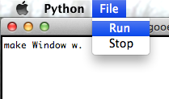

=========
Tutorials
=========

These tutorials are here to show examples of basic Gooey GUIs. If you're just starting to learn Gooey, you might want to go through some or all of the tutorials before you make your own GUI.

Basic Window
============

To start using Gooey, go to the terminal and navigate to the project folder. Type in the terminal::

 python3 gooey.py

Your Gooey editor will appear.

.. image:: images/gooeyeditor.png

You can now enter the Gooey language into the editor. 

To start, make an empty window. Type in the editor::

 make Window w. 
 
When you’re ready to run your GUI, go to the *File* menu and select *Run*. 
 

 
This is your live preview. Right now it’s a little boring. 

.. image:: images/preview.png

Make the window bigger or smaller with the set command. Type::

 set w size 250.

Now you’re ready to add a button. Type::

 make Button b with text “Hello”.

After you Run, your GUI should look like this

.. image:: images/hello.png

Now that you have a simple layout, you can modify your existing objects further by using the *set* function. Try::

 set w color green.
 
 .. image:: images/green.png

