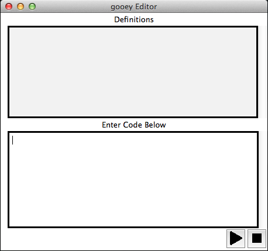
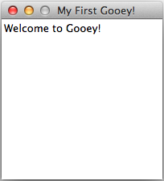

=========
Tutorials
=========

These tutorials are here to show examples of basic Gooey GUIs. If you're just starting to learn Gooey, you might want to go through some or all of the tutorials before you make your own GUI.

Window, Text, and Button Tutorial
=================================

To start using Gooey, go to the terminal and navigate to the project folder. Type in the terminal::

 python3 gooey.py

Your Gooey editor will appear.

.. image:: images/gooeyeditor.png

You can now enter the Gooey language into the editor. 

To start, make an empty window. Type in the editor::

 make Window win. 
 
When you’re ready to run your GUI, hit the play button at the bottom right corner.
 

 
This is your live preview. Right now it’s a little boring. 

.. image:: images/preview.png

Make the window bigger or smaller with the set command. The set command allows you to modify one or more things at a time. Try adjusting the title of the window, which will appear in the bar across the top. Type::

 set win size 5 5, title "My First Gooey".
 
.. image:: images/empty.png
 
An empty window is useless though. To add writing to your GUI, you'll need to add a Text object. Type::

 make Text greeting with text "Welcome to Gooey!".

Now you’re ready to add a button. Type::

 make Button hello with text “Hello”, position 1 1.

After you Run, your GUI should look like this

.. image:: images/hello.png

Your button is currently useless. You can click it, but since we haven't given it an *action* attribute, it won't do anything. You can modify existing objects further by using the *set* function.

Try::

 set b text "Go", action windowColorChange green.
 
Try clicking on the button, see what happens. Your window should have turned green. Gooey has a number of built in actions which you can find in the Actions section of the Gooey Docs.

Image, TextBox, Checkbox, and Menu Tutorial
===========================================

Now, let's try making a slightly more complicated Gooey.

Remember, always start by making a window::

 make Window w with title "Gooey Two", size 4 5, color #8fefdc.
 
 .. image:: images/gooeytwo.png
 
There are times when you might want your users to write something out. A TextBox is perfect in this situation! Type::

 make TextBox comments with text "Write your thoughts here".
 make Button submit with text "Submit", position 1 0.
 
But maybe instead of direct input, you merely want your users to choose between a few choices. A simple Checkbox looks like::

 make Checkboxes cb with options "Apple" "Peach" "Pumpkin Pie".
 
Each of the options you list will make another checkbox with that label. You can put a preface on your Checkboxes using the *title* attribute::

 set cb title "Choose from the following:". 

Now onto one of the most complex components of Gooey: Menus. 

The basic *Menu* object will keep track of the different menus you plan on having. For example::

 make Menu toplevel with options file edit.

will create two different drop down menu lists. To populate these lists, you need *MenuItem* objects. They should look like this::

 make MenuItem file with 
    title "File",
    options "Quit":quit
 make MenuItem edit with 
    title "Edit",
    options "Change color":quit "Change size":quit.
    
All of these actions will close your program. You can create your own object actions by making functions.

A simple function to simply change the window color looks like this::

 function myFunction(win) does set win color green; return win.
 
After making a function, there are two ways to use it. To run myFucntion on the Window w, either you can say::

 run myFunction(w).

or you can turn your function into an action for Buttons and MenuItems ::

 make Button b with action myFunction(w).
 
 make MenuItem edit with title "Edit",
    options "Change color":myFunciton(w) "Change size":quit.

Now you've gone through all the main components of Gooey. You're ready to make your own now!

